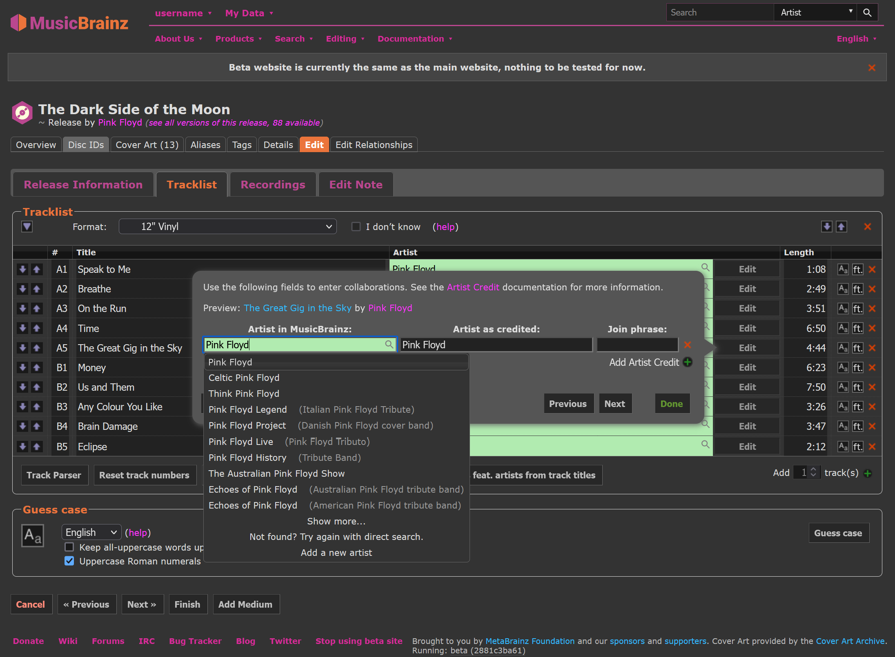
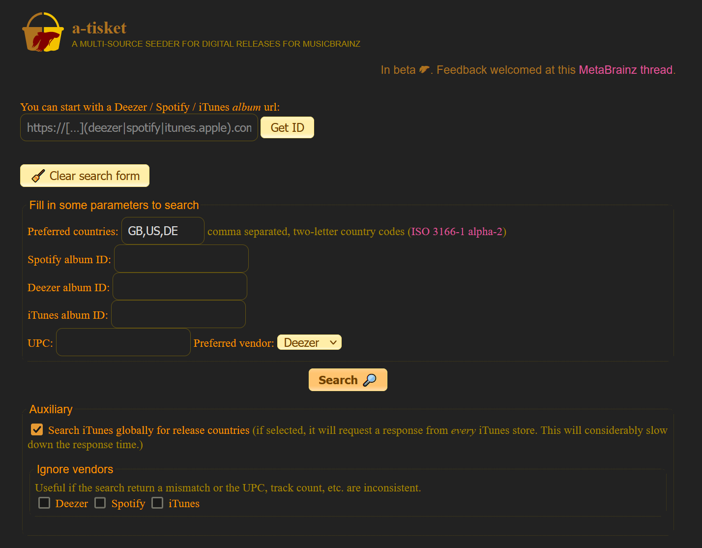

# Userstyles

**Userstyles for various websites** (well, mostly for MusicBrainz so far)

You have to install [Stylus](https://add0n.com/stylus.html) or a similar browser extension to be able to install the following userstyles.

## [MusicBrainz](https://musicbrainz.org)

### MusicBrainz Dark

Dark theme for the MusicBrainz website and wiki.
There is also a companion with additional style fixes for some popular userscripts.

&nbsp;

## [a-tisket](https://atisket.pulsewidth.org.uk/)

### dark-tisket

Simple dark theme for the a-tisket release seeder.
No longer used by myself as [Dark Reader](https://darkreader.org/) does a better job for it in my opinion.

